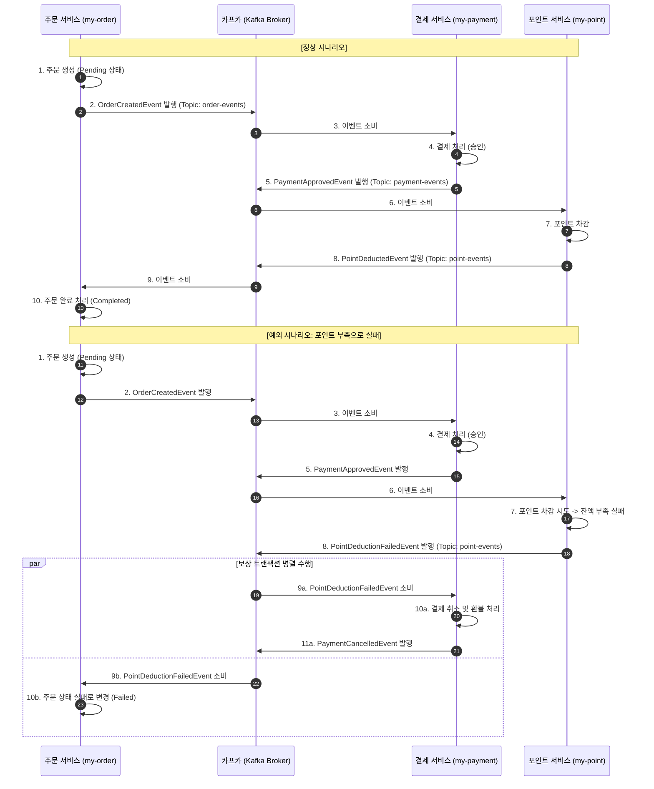

# 06. 카프카를 활용한 코레오그래피 Saga 패턴 적용 계획

## 1. 개요
본 문서는 Apache Kafka 메시지 브로커를 기반으로 한 분산 트랜잭션 **코레오그래피 Saga 패턴(Choreography Saga Pattern)** 적용 계획을 설명합니다. 중앙 오케스트레이터 없이 각 마이크로서비스(`my-order`, `my-payment`, `my-point`)가 이벤트를 발행(Publish)하고 구독(Subscribe)하며 자율적으로 트랜잭션의 일관성을 유지하는 아키텍처를 설계합니다.

---

## 2. 목적
- 중앙 집중식 통제 컴포넌트(Orchestrator)를 제거하여 시스템 간 결합도를 낮추고 유연성 확보
- 메시지 브로커(Kafka)를 통한 완전 비동기 이벤트 기반 통신 구현
- 장애 발생 시 자율적인 이벤트 소비를 통한 보상 트랜잭션(Compensation) 자동 처리

---

## 3. 아키텍처 및 이벤트 흐름

코레오그래피 패턴에서는 각 서비스가 로컬 트랜잭션을 완료한 후 이벤트를 발행하고, 다음 단계의 서비스가 이 이벤트를 감지하여 자신의 비즈니스 로직을 수행합니다.

### 3.1. 정상 흐름 (Happy Path)
1. **주문 서비스 (`my-order`)**: 주문 요청을 받아 대기 상태(`ORDER_PENDING`)로 주문을 저장하고, `OrderCreatedEvent`를 발행합니다.
2. **결제 서비스 (`my-payment`)**: `OrderCreatedEvent`를 구독하여 결제를 처리하고, 성공 시 `PaymentApprovedEvent`를 발행합니다.
3. **포인트 서비스 (`my-point`)**: `PaymentApprovedEvent`를 구독하여 포인트를 적립/차감하고, 성공 시 `PointDeductedEvent`를 발행합니다.
4. **주문 서비스 (`my-order`)**: `PointDeductedEvent`를 구독하여 주문 상태를 완료(`ORDER_COMPLETED`)로 변경합니다.

### 3.2. 보상 흐름 (Compensation Path - 예: 포인트 부족으로 실패 시)
1. **포인트 서비스 (`my-point`)**: 포인트 차감 실패 시 `PointDeductionFailedEvent`를 발행합니다.
2. **결제 서비스 (`my-payment`)**: `PointDeductionFailedEvent`를 구독하여 이전에 완료된 결제를 취소(환불)하고, `PaymentCancelledEvent`를 발행합니다.
3. **주문 서비스 (`my-order`)**: `PointDeductionFailedEvent` 또는 `PaymentCancelledEvent`를 구독하여 주문 상태를 취소(`ORDER_FAILED` 또는 `ORDER_CANCELLED`)로 변경하고 트랜잭션을 롤백 처리합니다.

---

## 4. Saga 흐름 시나리오 (Mermaid)



---

## 5. 로컬 개발 환경 설정 (Docker Compose)

주키퍼(Zookeeper) 없이 KRaft(Kafka Raft) 메타데이터 모드를 활용하는 최신 카프카 단일 브로커 설정 및 메시지 감시를 위한 대시보드(Kafka UI) 구성을 포함한 `docker-compose-kafka.yml` 예시입니다.

```yaml
version: '3.8'

services:
  kafka:
    image: confluentinc/cp-kafka:7.4.0
    container_name: kafka
    ports:
      - "9092:9092"
    environment:
      KAFKA_NODE_ID: 1
      KAFKA_PROCESS_ROLES: 'broker,controller'
      KAFKA_CONTROLLER_QUORUM_VOTERS: '1@kafka:29093'
      KAFKA_LISTENERS: 'PLAINTEXT://0.0.0.0:29092,CONTROLLER://0.0.0.0:29093,PLAINTEXT_HOST://0.0.0.0:9092'
      KAFKA_ADVERTISED_LISTENERS: 'PLAINTEXT://kafka:29092,PLAINTEXT_HOST://localhost:9092'
      KAFKA_INTER_BROKER_LISTENER_NAME: 'PLAINTEXT'
      KAFKA_CONTROLLER_LISTENER_NAMES: 'CONTROLLER'
      KAFKA_LISTENER_SECURITY_PROTOCOL_MAP: 'CONTROLLER:PLAINTEXT,PLAINTEXT:PLAINTEXT,PLAINTEXT_HOST:PLAINTEXT'
      KAFKA_OFFSETS_TOPIC_REPLICATION_FACTOR: 1
      KAFKA_TRANSACTION_STATE_LOG_MIN_ISR: 1
      KAFKA_TRANSACTION_STATE_LOG_REPLICATION_FACTOR: 1
      KAFKA_GROUP_INITIAL_REBALANCE_DELAY_MS: 0
      KAFKA_LOG_DIRS: '/tmp/kraft-combined-logs'
      # KRaft 모드를 사용하기 위한 고유 클러스터 ID 설정
      CLUSTER_ID: 'MkU3OEVETK-0GCmBId-tDw'

  kafka-ui:
    image: provectuslabs/kafka-ui:latest
    container_name: kafka-ui
    ports:
      - "8080:8080"
    environment:
      DYNAMIC_CONFIG_ENABLED: 'true'
      KAFKA_CLUSTERS_0_NAME: local-kraft-cluster
      KAFKA_CLUSTERS_0_BOOTSTRAPSERVERS: kafka:29092
    depends_on:
      - kafka
```

---

## 6. 단계별 구현 계획

### Step 1: Kafka 인프라 구성
- [ ] `docker-compose-kafka.yml`을 작성하여 로컬 카프카 환경 실행
- [ ] 각 마이크로서비스(`my-order`, `my-payment`, `my-point`)의 `pom.xml` 또는 `build.gradle`에 Spring Cloud Stream Kafka / Spring Kafka 의존성 추가
- [ ] `application.yml` 파일에 Kafka Broker 주소 및 토픽 설정 추가

### Step 2: 도메인 이벤트 정의 및 DTO 설계
- [ ] 이벤트 메시지 객체 정의 (예: `OrderCreatedEvent`, `PaymentApprovedEvent`, `PointDeductionFailedEvent` 등)
- [ ] DTO 변환 규칙 준수 (컨트롤러 DTO가 이벤트 또는 서비스 객체로 유출되지 않도록 전용 Command 및 Event 객체 구성)

### Step 3: 이벤트 발행자(Publisher) 및 소비자(Consumer) 구현
- [ ] 레이어드 아키텍처 준수: 
  - 컨트롤러 -> 서비스 -> 레포지토리
  - 서비스 레이어에서 로컬 비즈니스 로직 처리 성공 후 `ApplicationEventPublisher`를 통해 로컬 이벤트 발행
  - 이벤트 리스너(Listener)가 Kafka 토픽으로 메시지 송신 (Transactional Outbox 패턴 고려 가능)
- [ ] TDD 방식을 적용하여 메시지 발행 및 소비 로직 검증 테스트 작성

### Step 4: 예외 처리 및 보상 트랜잭션 구현
- [ ] 포인트 부족 등 예외 발생 시 실패 이벤트 발행 로직 구현
- [ ] 각 서비스에서 실패 이벤트를 구독 시, 비즈니스 롤백을 수행하는 보상 트랜잭션 서비스 메서드 구현
- [ ] 글로벌 예외 처리기를 통해 비즈니스 예외와 인프라 예외 구분 처리

---

## 7. 설계 고려사항 및 트레이드 오프

1. **데이터 최종 일관성 (Eventual Consistency)**:
   - 데이터가 즉시 일관성을 유지하지 않고, 시간이 지남에 따라 일관성이 맞춰집니다. 비즈니스 요구사항에 따라 최종 일관성 수용 여부를 조율해야 합니다.
2. **이벤트 중복 소비 및 멱등성 (Idempotency)**:
   - 네트워크 장애 등으로 동일한 이벤트가 여러 번 소비될 수 있습니다. 주문 ID나 트랜잭션 ID를 검사하여 이미 처리된 요청은 무시하는 멱등성 로직이 반드시 필요합니다.
3. **이벤트 순서 보장 (Ordering)**:
   - 주문 생성 후 취소와 같이 이벤트의 순서가 뒤바뀌면 정합성이 깨집니다. Kafka의 메시지 키(Partition Key)로 `orderId`를 지정하여 동일 주문에 대한 메시지가 항상 동일한 파티션에 순서대로 적재되도록 보장합니다.
4. **트랜잭셔널 아웃박스 패턴 (Transactional Outbox Pattern)**:
   - 데이터베이스 업데이트와 카프카 이벤트 발행이 단일 트랜잭션 묶음으로 처리되지 않을 수 있습니다. 데이터베이스에 아웃박스 테이블을 두고 이벤트를 임시 저장한 후, 별도 데몬(Debezium 등)이나 스케줄러가 이벤트를 발행하는 방식을 고려해 신뢰성을 극대화합니다.
