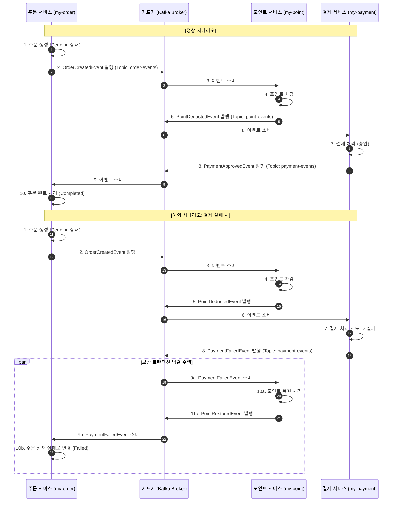

# 06. 카프카를 활용한 코레오그래피 Saga 패턴 및 아웃박스 패턴 적용 상세

## 1. 개요
본 문서는 Apache Kafka 메시지 브로커를 기반으로 한 분산 트랜잭션 **코레오그래피 Saga 패턴(Choreography Saga Pattern)** 및 **트랜잭셔널 아웃박스 패턴(Transactional Outbox Pattern)** 적용 현황을 설명합니다. 중앙 오케스트레이터 없이 각 마이크로서비스(`my-order`, `my-payment`, `my-point`)가 이벤트를 발행(Publish)하고 구독(Subscribe)하며 자율적으로 트랜잭션의 일관성을 유지하고, 데이터베이스 트랜잭션과 이벤트 발행 간의 이중 쓰기(Dual Write) 문제를 해결하기 위해 Debezium CDC 기반의 아웃박스 패턴을 적용했습니다.

---

## 2. 목적
- 중앙 집중식 통제 컴포넌트(Orchestrator)를 제거하여 시스템 간 결합도를 낮추고 유연성 확보
- 메시지 브로커(Kafka)를 통한 완전 비동기 이벤트 기반 통신 구현
- 장애 발생 시 자율적인 이벤트 소비를 통한 보상 트랜잭션(Compensation) 자동 처리

---

## 3. 아키텍처 및 이벤트 흐름

코레오그래피 패턴에서는 각 서비스가 로컬 트랜잭션을 완료한 후 이벤트를 발행하고, 다음 단계의 서비스가 이 이벤트를 감지하여 자신의 비즈니스 로직을 수행합니다.

### 3.1. 정상 흐름 (Happy Path)
1. **주문 서비스 (`my-order`)**: 주문 요청을 받아 대기 상태(`ORDER_PENDING`)로 주문을 저장하고, `OrderCreatedEvent`를 발행합니다.
2. **포인트 서비스 (`my-point`)**: `OrderCreatedEvent`를 구독하여 포인트를 차감하고, 성공 시 `PointDeductedEvent`를 발행합니다.
3. **결제 서비스 (`my-payment`)**: `PointDeductedEvent`를 구독하여 결제를 처리하고, 성공 시 `PaymentApprovedEvent`를 발행합니다.
4. **주문 서비스 (`my-order`)**: `PaymentApprovedEvent`를 구독하여 주문 상태를 완료(`ORDER_COMPLETED`)로 변경합니다.

### 3.2. 보상 흐름 (Compensation Path - 예: 결제 실패 시)
1. **결제 서비스 (`my-payment`)**: 결제 처리 실패 시 `PaymentFailedEvent`를 발행합니다.
2. **포인트 서비스 (`my-point`)**: `PaymentFailedEvent`를 구독하여 이전에 차감된 포인트를 복원하고, `PointRestoredEvent`를 발행합니다.
3. **주문 서비스 (`my-order`)**: `PaymentFailedEvent` 또는 `PointRestoredEvent`를 구독하여 주문 상태를 취소(`ORDER_FAILED` 또는 `ORDER_CANCELLED`)로 변경하고 트랜잭션을 롤백 처리합니다.

---

## 4. Saga 흐름 시나리오 (Mermaid)



---

## 5. 로컬 개발 환경 설정 (Docker Compose)

주키퍼(Zookeeper) 없이 KRaft(Kafka Raft) 메타데이터 모드를 활용하는 최신 카프카 단일 브로커 설정 및 메시지 감시를 위한 대시보드(Kafka UI) 구성을 포함한 `docker-compose-kafka.yml` 예시입니다.

```yaml
version: '3.8'

services:
  kafka:
    image: confluentinc/cp-kafka:7.4.0
    container_name: kafka
    ports:
      - "9092:9092"
    environment:
      KAFKA_NODE_ID: 1
      KAFKA_PROCESS_ROLES: 'broker,controller'
      KAFKA_CONTROLLER_QUORUM_VOTERS: '1@kafka:29093'
      KAFKA_LISTENERS: 'PLAINTEXT://0.0.0.0:29092,CONTROLLER://0.0.0.0:29093,PLAINTEXT_HOST://0.0.0.0:9092'
      KAFKA_ADVERTISED_LISTENERS: 'PLAINTEXT://kafka:29092,PLAINTEXT_HOST://localhost:9092'
      KAFKA_INTER_BROKER_LISTENER_NAME: 'PLAINTEXT'
      KAFKA_CONTROLLER_LISTENER_NAMES: 'CONTROLLER'
      KAFKA_LISTENER_SECURITY_PROTOCOL_MAP: 'CONTROLLER:PLAINTEXT,PLAINTEXT:PLAINTEXT,PLAINTEXT_HOST:PLAINTEXT'
      KAFKA_OFFSETS_TOPIC_REPLICATION_FACTOR: 1
      KAFKA_TRANSACTION_STATE_LOG_MIN_ISR: 1
      KAFKA_TRANSACTION_STATE_LOG_REPLICATION_FACTOR: 1
      KAFKA_GROUP_INITIAL_REBALANCE_DELAY_MS: 0
      KAFKA_LOG_DIRS: '/tmp/kraft-combined-logs'
      # KRaft 모드를 사용하기 위한 고유 클러스터 ID 설정
      CLUSTER_ID: 'MkU3OEVETK-0GCmBId-tDw'

  kafka-ui:
    image: provectuslabs/kafka-ui:latest
    container_name: kafka-ui
    ports:
      - "8080:8080"
    environment:
      DYNAMIC_CONFIG_ENABLED: 'true'
      KAFKA_CLUSTERS_0_NAME: local-kraft-cluster
      KAFKA_CLUSTERS_0_BOOTSTRAPSERVERS: kafka:29092
    depends_on:
      - kafka
```

---

## 6. 단계별 구현 결과 및 완료 여부

### Step 1: Kafka 인프라 구성
- [x] `docker-compose-kafka.yml`을 작성하여 로컬 카프카 환경 실행 완료
- [x] 각 마이크로서비스(`my-order`, `my-payment`, `my-point`)에 Kafka 연동 라이브러리 및 Spring Cloud Stream Binding 구성 완료
- [x] `application.yaml` 파일에 Kafka Broker 주소 및 토픽 설정 추가 완료

### Step 2: 도메인 이벤트 정의 및 DTO 설계
- [x] 이벤트 메시지 객체 정의 (`OrderCreatedEvent`, `PointDeductedEvent`, `PointRestoredEvent`, `PointDeductionFailedEvent`, `PaymentApprovedEvent`, `PaymentFailedEvent`) 완료
- [x] DTO 변환 규칙 준수 (컨트롤러 DTO와 도메인 이벤트 객체 분리, 비즈니스 명령 전달용 Command 객체 구성) 완료

### Step 3: 이벤트 발행자(Publisher) 및 소비자(Consumer) 구현
- [x] 레이어드 아키텍처 준수: 
  - 컨트롤러 -> 서비스 -> 레포지토리
  - 서비스 레이어에서 로컬 비즈니스 로직 처리 성공 후 `OutboxEvent` 엔티티를 생성하여 동일 데이터베이스 트랜잭션 내에서 `outbox` 테이블에 영속화 완료
  - Debezium CDC 커넥터를 연동하여 `outbox` 테이블의 변경사항을 감지하고 자동으로 각 Kafka 토픽으로 발행
- [x] TDD 방식을 적용하여 메시지 발행 및 소비 로직 검증 테스트 작성 완료 (`OrderServiceTest`, `PointServiceTest`, `PaymentServiceTest` 내 JUnit 테스트 수행)

### Step 4: 예외 처리 및 보상 트랜잭션 구현
- [x] 예외 발생 시 실패 이벤트를 별도의 독립 트랜잭션(`@Transactional(propagation = Propagation.REQUIRES_NEW)`)으로 아웃박스에 저장 및 발행하는 메커니즘 구현 완료
- [x] 각 서비스에서 실패 이벤트를 구독하여 비즈니스 롤백을 수행하는 보상 트랜잭션(예: 결제 실패 시 포인트 복구 및 주문 상태 실패로 변경) 구현 완료
- [x] 글로벌 예외 처리기 구현 완료

---

## 7. 설계 고려사항 및 트레이드 오프

1. **데이터 최종 일관성 (Eventual Consistency)**:
   - 데이터가 즉시 일관성을 유지하지 않고, 시간이 지남에 따라 일관성이 맞춰집니다. 비즈니스 요구사항에 따라 최종 일관성 수용 여부를 조율해야 합니다.
2. **이벤트 중복 소비 및 멱등성 (Idempotency)**:
   - 네트워크 장애 등으로 동일한 이벤트가 여러 번 소비될 수 있습니다. 주문 ID나 트랜잭션 ID를 검사하여 이미 처리된 요청은 무시하는 멱등성 로직이 반드시 필요합니다.
3. **이벤트 순서 보장 (Ordering)**:
   - 주문 생성 후 취소와 같이 이벤트의 순서가 뒤바뀌면 정합성이 깨집니다. Kafka의 메시지 키(Partition Key)로 `aggregate_id`를 지정하여 동일 리소스에 대한 메시지가 항상 동일한 파티션에 순서대로 적재되도록 보장합니다.
4. **트랜잭셔널 아웃박스 패턴 (Transactional Outbox Pattern)**:
   - 비즈니스 데이터 업데이트와 카프카 이벤트 발행의 원자성을 보장하기 위해 데이터베이스 내 `outbox` 테이블을 영속화의 매개체로 사용합니다. 이를 통해 네트워크 순단이나 장애 상황에서도 메시지 소실 및 중복 발행을 완벽히 방지하여 결과적 일관성을 신뢰성 있게 보장합니다.

---

## 8. 트랜잭셔널 아웃박스 패턴(Transactional Outbox Pattern) 구현 상세

우리 프로젝트는 **Debezium CDC (Change Data Capture)** 기술과 **Outbox Event Router SMT(Single Message Transform)**를 결합하여 아웃박스 패턴을 구현했습니다.

### 8.1. 아웃박스 데이터 모델 및 JPA 엔티티 (`OutboxEvent`)

각 서비스(`my-order`, `my-payment`, `my-point`)의 데이터베이스에 공통적으로 `outbox` 테이블이 위치하며, 다음과 같은 스키마 구조를 가집니다.

```java
@Entity
@Table(name = "outbox")
@Getter
@NoArgsConstructor(access = AccessLevel.PROTECTED)
public class OutboxEvent {

    @Id
    @GeneratedValue(strategy = GenerationType.IDENTITY)
    private Long id;

    // 이벤트가 속한 애그리거트의 타입 (예: "order", "payment", "point")
    @Column(name = "aggregate_type", nullable = false)
    private String aggregateType;

    // 애그리거트의 식별값 (예: orderId, userId 등)
    @Column(name = "aggregate_id", nullable = false)
    private String aggregateId;

    // 이벤트의 종류 (예: "OrderCreatedEvent", "PaymentApprovedEvent" 등)
    @Column(name = "type", nullable = false)
    private String type;

    // JSON 형태의 이벤트 데이터 페이로드
    @Lob
    @Column(name = "payload", nullable = false, columnDefinition = "LONGTEXT")
    private String payload;

    @Column(name = "created_at", nullable = false)
    private LocalDateTime createdAt;
    
    // ... 생성 메서드
}
```

### 8.2. 로컬 트랜잭션과 아웃박스 적재의 통합

비즈니스 서비스(예: `OrderService.order()`)는 `@Transactional` 범위 내에서 비즈니스 엔티티 변경과 `OutboxEvent` 저장을 한 번에 처리합니다.

```java
@Transactional
public Long order(OrderCommand command) {
    // 1. 비즈니스 로직 및 엔티티 저장
    Order order = Order.create(command.getUserId(), command.getProductPrice(), command.getUsePoint());
    Order savedOrder = orderRepository.save(order);

    // 2. 도메인 이벤트 객체 정의
    OrderCreatedEvent event = new OrderCreatedEvent(
            savedOrder.getId(), savedOrder.getUserId(),
            savedOrder.getPaymentAmount(), savedOrder.getUsePoint()
    );

    // 3. 이벤트를 JSON으로 변환하여 Outbox 테이블에 저장 (동일 DB 트랜잭션 묶음)
    String payload = objectMapper.writeValueAsString(event);
    OutboxEvent outboxEvent = OutboxEvent.create(
            "order", String.valueOf(savedOrder.getId()), "OrderCreatedEvent", payload
    );
    outboxRepository.save(outboxEvent);

    return savedOrder.getId();
}
```
> [!NOTE]
> 만약 비즈니스 로직 중 예외가 발생하면 전체 DB 트랜잭션이 롤백되어 `outbox` 테이블의 이벤트 데이터도 함께 롤백됩니다. 따라서 **Dual Write** 상황에서 발생하는 데이터베이스-메시지 브로커 간 불일치가 발생하지 않습니다.

### 8.3. 실패/예외 처리용 독립 트랜잭션 아웃박스 발행 (`REQUIRES_NEW`)

트랜잭션 도중 실패가 발생하여 주 트랜잭션이 롤백되어야 하지만, 이미 완료된 이전 단계 서비스들에게 실패 및 보상 트랜잭션을 트리거해야 하는 경우(`PaymentFailedEvent` 혹은 `PointDeductionFailedEvent`), 실패 이벤트를 전달하기 위해 별도의 독립 트랜잭션을 사용합니다.

```java
@Transactional(propagation = Propagation.REQUIRES_NEW)
public void savePaymentFailedOutbox(Long orderId, Long userId, Long usePoint, String reason) {
    PaymentFailedEvent failedEvent = new PaymentFailedEvent(orderId, userId, usePoint, reason);
    String payload = objectMapper.writeValueAsString(failedEvent);
    OutboxEvent outboxEvent = OutboxEvent.create(
            "payment", String.valueOf(orderId), "PaymentFailedEvent", payload
    );
    outboxRepository.save(outboxEvent);
}
```

### 8.4. Debezium 커넥터 및 SMT(Single Message Transform) 구성

Debezium 커넥터는 `outbox` 테이블의 MySQL Binary Log를 감시하며 변경 내역(Insert)이 발생하면 메시지를 카프카로 라우팅합니다. 이때 `transforms` 설정을 통해 원시 DB 로그 형태가 아닌 정제된 JSON 메시지로 전송합니다.

```json
{
  "name": "order-outbox-connector-v3",
  "config": {
    "connector.class": "io.debezium.connector.mysql.MySqlConnector",
    "database.include.list": "order_db",
    "table.include.list": "order_db.outbox",
    
    // Outbox Event Router SMT 설정
    "transforms": "outbox",
    "transforms.outbox.type": "io.debezium.transforms.outbox.EventRouter",
    
    // 1. aggregate_type 컬럼값을 참조하여 '{aggregate_type}-events' 토픽으로 메시지 라우팅
    "transforms.outbox.route.topic.replacement": "${routedByValue}-events",
    "transforms.outbox.route.by.field": "aggregate_type",
    
    // 2. 카프카 메시지 헤더/메타데이터 매핑
    "transforms.outbox.table.field.event.id": "id",
    "transforms.outbox.table.field.event.key": "aggregate_id", // 순서성 보장을 위한 파티션 키
    "transforms.outbox.table.field.event.type": "type",
    "transforms.outbox.table.field.event.payload": "payload",
    
    // 3. payload 컬럼의 JSON String 데이터를 온전한 JSON Object 형태로 카프카에 적재
    "transforms.outbox.table.expand.json.payload": "true",
    "transforms.outbox.op.invalid.behavior": "warn"
  }
}
```

- **동적 토픽 분배**: `aggregate_type`에 지정한 값(`order`, `payment`, `point`)에 맞춰 자동으로 `order-events`, `payment-events`, `point-events` 카프카 토픽에 발행됩니다.
- **순서성 보장**: `aggregate_id`(예: `orderId`)가 카프카 레코드의 `Key`로 사용되므로 동일한 주문 관련 흐름은 항상 동일 파티션에 순차 적재됩니다.
- **Payload Unwrapping**: `expand.json.payload: true` 옵션을 사용해 데이터베이스에서 JSON 문자열(Text)로 관리하던 payload 데이터를 카프카 메시지로 변환 시 JSON Object 형태로 풀어서 넣어주므로 구독하는 Consumer 측에서 파싱이 수월합니다.
