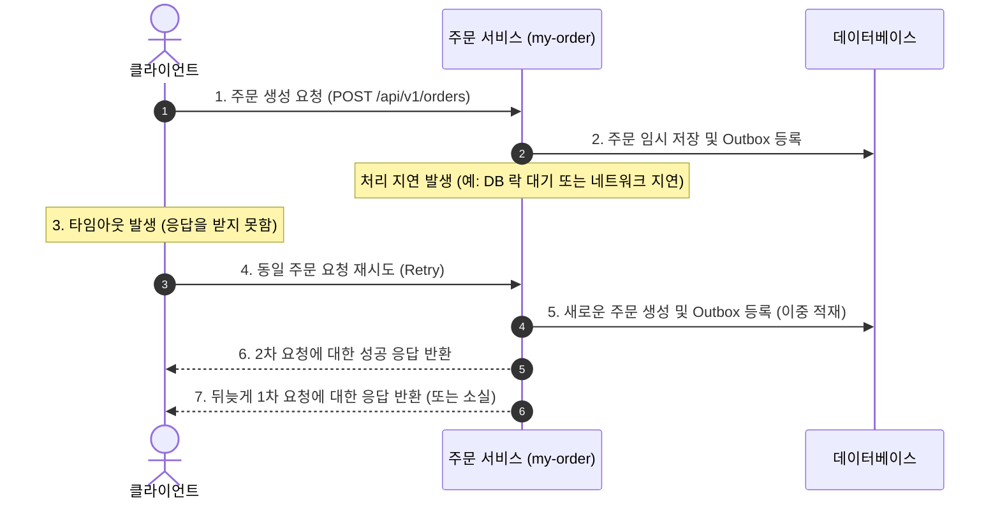
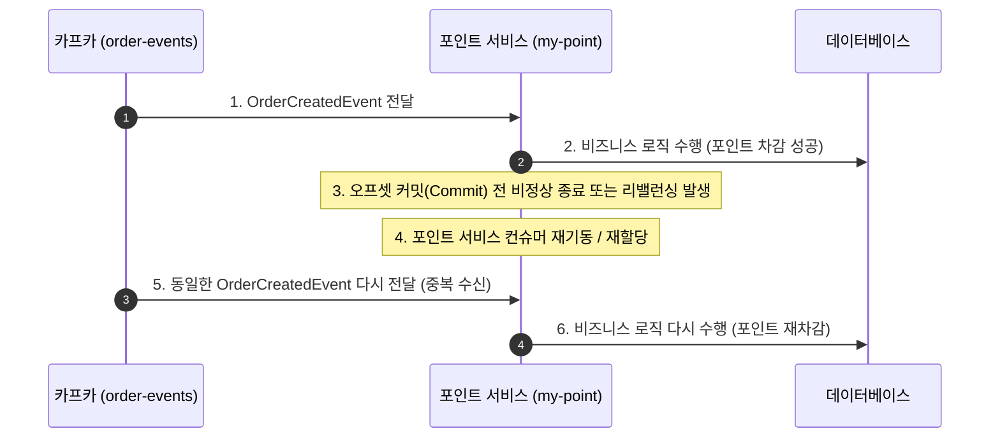
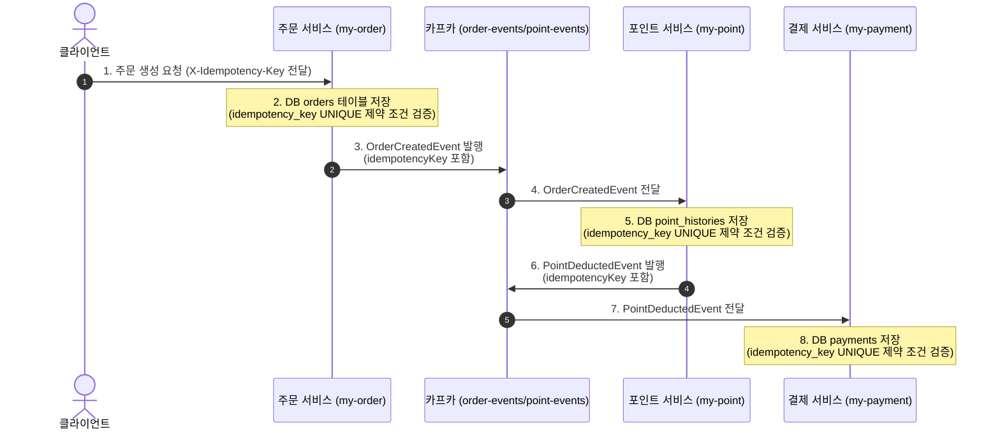

# 07. 멱등성 미처리로 인한 분산 트랜잭션 오류 재현 시나리오

본 문서는 분산 트랜잭션 환경에서 **멱등성(Idempotency)** 처리가 누락되었을 때 발생할 수 있는 치명적인 정합성 오류를 검증하고 재현하기 위한 가이드입니다. 

멱등성이란 동일한 연산을 여러 번 수행하더라도 결과가 항상 같아야 함을 의미합니다. 분산 시스템에서는 네트워크 지연, 서비스 장애, 재시도(Retry) 메커니즘으로 인해 동일한 요청이나 메시지가 중복으로 전달되는 상황이 빈번하게 발생하므로 멱등성 보장이 필수적입니다.

본 가이드에서는 다음 두 가지 치명적인 시나리오를 재현합니다.
1. **클라이언트 측 중복 요청**: 네트워크 타임아웃 등으로 인해 클라이언트가 주문 API를 재시도할 때 발생하는 중복 결제 문제
2. **서버 측(Kafka) 메시지 중복 소비**: 카프카 컨슈머 장애, 리밸런싱, 혹은 At-Least-Once 전달 정책에 의해 동일한 이벤트가 중복 처리되어 포인트가 이중으로 차감되는 문제

---

## 1. 사전 준비 사항
재현 테스트를 수행하기 전에 모든 마이크로서비스와 인프라가 정상 동작 중이어야 합니다.

* **실행 인프라**: Kafka, MySQL, Kafka-UI, Debezium 커넥터 등
* **실행 서비스**:
  * 주문 서비스 (`my-order` - Port: `8081`)
  * 포인트 서비스 (`my-point` - Port: `8082`)
  * 결제 서비스 (`my-payment` - Port: `8083`)

> [!NOTE]
> 로컬 인프라 구동 및 설정 방법은 [06_코레오그래피.md](file:///D:/projects/mastering-distributed-transaction/docs/06_코레오그래피.md) 문서를 참고하시기 바랍니다.

---

## 2. 시나리오 1: 클라이언트 측 중복 요청 재현 스텝
클라이언트가 API를 호출했으나, 네트워크 단절이나 서버 처리 지연으로 인해 응답을 제때 받지 못하고 동일 요청을 재시도(Retry)할 때 발생하는 정합성 붕괴 상황입니다.

### 2.1. 문제 발생 원인 흐름도


### 2.2. 재현 스텝
이 테스트는 API 클라이언트에서 동일한 내용의 주문 요청을 매우 짧은 시간차로 두 번 호출하거나, 서버측 비즈니스 로직에 인위적인 지연(Delay)을 걸고 클라이언트의 재시도를 시뮬레이션하여 수행합니다.

#### Step 1. 재현용 HTTP 요청 준비
[msa-test.http](file:///D:/projects/mastering-distributed-transaction/msa-test.http) 파일 또는 cURL을 이용하여 짧은 시간 간격(예: 100ms 이내)으로 동일한 페이로드를 전송합니다.

* **요청 정보**:
  * URL: `POST http://localhost:8081/api/v1/orders`
  * Header: `Content-Type: application/json`
  * Payload:
    ```json
    {
      "userId": 4,
      "productPrice": 50000,
      "usePoint": 1000
    }
    ```

#### Step 2. 요청 전송 및 지연 유도 (선택 사항)
* **방법 A (동시 요청)**: 별도의 스트레스 테스트 도구(JMeter, autocannon 등)나 스크립트를 사용하여 위 API를 동시에 2회 호출합니다.
* **방법 B (서버 코드 지연 후 재시도)**: 
  * `my-order` 서비스의 주문 생성 컨트롤러나 서비스 메서드 시작 부분에 `Thread.sleep(3000);` 코드를 삽입하여 인위적인 지연을 유발합니다.
  * HTTP 클라이언트의 Read Timeout을 `1.5초`로 설정한 상태로 요청을 보냅니다.
  * 클라이언트는 1.5초 후 Timeout 예외가 발생하므로 즉시 동일한 페일로드로 다시 요청을 전송합니다.

#### Step 3. 데이터베이스 결과 검증
데이터베이스에 접속하여 각 서비스의 최종 상태를 조회합니다. 멱등성 처리가 없는 경우 다음과 같은 심각한 오작동 결과가 도출됩니다.

1. **주문 테이블 (`order_db.orders`) 조회**:
   ```sql
   SELECT * FROM order_db.orders WHERE user_id = 4 ORDER BY id DESC;
   ```
   * **예상되는 정합성 오류**: 단 한 번의 실제 구매 의사였음에도 불구하고 주문 건이 **2개 생성**되어 각각 `ORDER_COMPLETED` 상태로 완료됩니다. (각 주문은 고유한 `id`를 가짐)

2. **포인트 차감 이력 테이블 조회**:
   ```sql
   SELECT * FROM point_db.point_histories WHERE user_id = 4 ORDER BY id DESC;
   ```
   * **예상되는 정합성 오류**: 포인트 1,000원이 한 번만 차감되어야 하지만, 1,000원씩 **총 2번(2,000원) 차감**됩니다.

3. **결제 이력 테이블 조회**:
   ```sql
   SELECT * FROM payment_db.payments WHERE user_id = 4 ORDER BY id DESC;
   ```
   * **예상되는 정합성 오류**: 결제 금액인 49,000원(50,000원 - 1,000원)이 **이중 결제(총 98,000원)**로 승인 처리됩니다.

---

## 3. 시나리오 2: 서버 측(Kafka) 메시지 중복 소비 재현 스텝
카프카 메시지 컨슈머 환경에서 메시지를 중복해서 수신 및 소비하게 되는 상황입니다. 네트워크 장애로 인해 컨슈머가 이벤트를 정상 처리하고도 브로커에 갱신된 오프셋(Offset)을 커밋하기 전에 크래시가 나거나, 컨슈머 그룹의 리밸런싱이 일어나 다른 컨슈머 노드에 동일 메시지가 재할당되는 경우 발생합니다.

### 3.1. 문제 발생 원인 흐름도


### 3.2. 재현 스텝
포인트 서비스(`my-point`)가 `order-events` 토픽에서 주문 생성 이벤트(`OrderCreatedEvent`)를 구독하여 처리하는 과정을 기준으로 중복 처리를 재현합니다.

#### Step 1. 카프카 토픽에 인위적으로 중복 메시지 발행
동일한 주문 식별자(`orderId`)와 페이로드를 가진 이벤트를 카프카에 연달아 2번 직접 발행하여 중복 수신 환경을 만듭니다.

* **방법 A (Kafka UI 활용)**:
  1. `http://localhost:8080` (Kafka UI)에 접속합니다.
  2. `order-events` 토픽을 선택하고 `Produce Message` 메뉴로 이동합니다.
  3. 아래의 JSON 페이로드(이벤트 객체)를 작성하고 `Produce`를 누릅니다. (Key는 `100`으로 통일하여 같은 파티션 유도)
     ```json
     {
       "orderId": 100,
       "userId": 5,
       "paymentAmount": 9000,
       "usePoint": 1000
     }
     ```
  4. **잠시 대기하지 않고 즉시** 동일한 내용으로 `Produce` 버튼을 한 번 더 클릭하여 두 번째 동일 메시지를 발행합니다.

* **방법 B (애플리케이션 코드 내 1회성 의도적 예외 발생)**:
  컨슈머 애플리케이션 실행 중 사용자가 프로세스를 직접 강제 종료하거나 재기동하지 않고, 컨슈머 리스너 코드 내에 **1회만 발생하도록 제어된 예외**를 주입하여 오프셋 커밋 누락 및 자동 재시도에 따른 중복 소비를 유도합니다.
  
  1. `my-point` 서비스의 컨슈머 리스너 클래스에 다음과 같이 의도적 예외 발생 플래그와 1회성 예외 코드를 작성합니다.
     ```java
     // 중복 예외 발생 및 무한 루프를 방지하기 위해 static 플래그로 최초 1회만 예외를 던집니다.
     private static boolean hasThrownException = false;

     @KafkaListener(topics = "order-events", groupId = "point-service-group")
     public void handleOrderCreated(String message) {
         try {
             OrderCreatedEvent event = objectMapper.readValue(message, OrderCreatedEvent.class);
             log.info("PointEventListener - 주문 생성 이벤트 수신. orderId: {}, userId: {}", event.getOrderId(), event.getUserId());

             // 1. 포인트 차감 비즈니스 로직 정상 처리 (DB 반영 완료)
             pointService.usePoint(event.getOrderId(), event.getUserId(), event.getUsePoint(), event.getPaymentAmount());

             // 2. 오프셋 커밋 직전, 의도적으로 1회에 한해 RuntimeException 발생 (try-catch 외부로 던져야 함)
             if (!hasThrownException) {
                 hasThrownException = true;
                 log.warn("=== [재현 테스트] 의도적인 1회성 예외 발생 (오프셋 커밋 누락 유도) ===");
                 throw new RuntimeException("Intentional offset commit failure for idempotency test");
             }

         } catch (Exception e) {
             // 의도적인 1회성 예외인 경우 그대로 전파하여 오프셋 커밋 방지 및 재시도 유도
             if (e.getMessage() != null && e.getMessage().contains("Intentional offset commit failure")) {
                 throw e;
             }
             log.error("order-events 메시지 처리 중 오류 발생. message: {}", message, e);
             try {
                 OrderCreatedEvent event = objectMapper.readValue(message, OrderCreatedEvent.class);
                 if (event.getOrderId() != null) {
                     pointService.savePointDeductionFailedOutbox(event.getOrderId(), e.getMessage());
                 }
             } catch (Exception ex) {
                 log.error("포인트 차감 실패 아웃박스 적재 실패. message: {}", message, ex);
             }
         }
     }
     ```
  2. 주문 API `POST /api/v1/orders`를 1회 요청하여 `OrderCreatedEvent`를 발행시킵니다.
  3. **재동작 및 중복 소비 흐름**:
     * **1차 소비 시도**: 포인트가 정상 차감되고 `PointDeductedEvent`가 아웃박스에 적재되지만, 메서드 리턴 직전에 `RuntimeException`을 던져 메시지 소비가 실패하며 오프셋이 커밋되지 않습니다.
     * **재시도(Retry) / 재소비 시도**: Spring Kafka의 컨슈머 에러 핸들러 및 재시도 메커니즘에 의해 해당 메시지가 다시 컨슈머로 유입됩니다. 이때 `hasThrownException` 플래그가 `true`이므로 더 이상 예외가 발생하지 않고 2번째 포인트 차감(중복 처리)을 수행한 뒤 정상적으로 오프셋을 커밋합니다.


#### Step 2. 데이터베이스 및 콘솔 로그 검증
1. **포인트 서비스 콘솔 로그 확인**:
   * 동일한 `orderId: 100`에 대해 포인트 차감 로직이 **2회 연속으로 실행**되고 로그가 2줄 출력되는 것을 확인합니다.
   * `my-point` 서비스에서 `PointDeductedEvent`를 **2회 발행**하여 아웃박스 테이블에 2개의 이벤트가 등록됩니다.

2. **포인트 서비스 DB (`point_db.point_histories`) 조회**:
   ```sql
   SELECT * FROM point_db.point_histories WHERE user_id = 5 ORDER BY id DESC;
   ```
   * **예상되는 정합성 오류**: 동일한 `orderId` 혹은 동일 `userId`에 대해 포인트 차감(1,000원) 내역이 **2번 중복 적재**되어 있습니다. 사용자는 원래 잔액에서 총 2,000원이 삭감되는 피해를 입게 됩니다.

3. **결제 서비스 DB (`payment_db.payments`) 조회**:
   ```sql
   SELECT * FROM payment_db.payments WHERE user_id = 5 ORDER BY id DESC;
   ```
   * **예상되는 정합성 오류**: 포인트 차감 이벤트가 2번 발행되었으므로, 이를 구독하는 결제 서비스 역시 결제 승인 요청을 **2번 수신**하여 각각에 대해 독립적으로 승인 처리합니다. 이에 따라 결제 역시 이중 결제 처리가 됩니다.

---

## 4. 시나리오 요약 및 검증 결과

| 구분 | 시나리오 1: 클라이언트 중복 요청 | 시나리오 2: 서버(카프카) 메시지 중복 소비 |
| :--- | :--- | :--- |
| **발생 위치** | 클라이언트 $\rightarrow$ 주문 서비스 (`my-order`) | 카프카 브로커 $\rightarrow$ 포인트/결제 서비스 |
| **트리거 원인** | 브라우저/앱 재시도, 네트워크 API 타임아웃 | 컨슈머 장애, 리밸런싱, At-Least-Once 발송 정책 |
| **데이터베이스 현상** | `orders` 테이블에 서로 다른 `id`로 중복 주문 적재 | `point_histories`에 동일 `orderId`로 중복 차감 이력 적재 |
| **영향도** | 주문 건이 2개 생성되어 이중 결제 유발 | 1개 주문에 대해 포인트 차감 및 결제가 이중으로 승인됨 |

위 재현 스텝을 통해 멱등성 처리가 없는 분산 시스템은 **단 한 번의 비정상적인 네트워크 순단이나 컨슈머 재기동만으로도 서비스 정합성이 즉각 파괴**됨을 증명할 수 있습니다. 

이를 해결하기 위해 각 서비스 레이어에서는 **Unique Key 제약 조건**, **멱등성 검증용 트랜잭션 테이블(Idempotency Key Table)**, 또는 **상태 기계 기반 검증** 로직을 도입하여 이미 처리 완료된 식별자에 대한 재요청을 즉시 필터링(Discard 또는 성공 결과 반환)할 수 있도록 보완해야 합니다.

---

## 5. 멱등성 처리 개발 계획 (전체 서비스 통합)

분산 시스템의 정합성을 보장하기 위해 클라이언트-서버 간 주문 요청부터 시작하여 이벤트 기반으로 전파되는 전체 파이프라인(주문 -> 포인트 차감 -> 결제 승인)에서 멱등성을 보장하는 개발 계획을 수립합니다.

### 5.1. 아키텍처 설계 및 흐름



1. **클라이언트 (Client)**
   - 주문 생성 요청(`POST /api/v1/orders`)을 보낼 때, 클라이언트 측에서 고유한 **멱등키(Idempotency Key)**를 생성하여 요청 헤더(`X-Idempotency-Key`) 또는 요청 페이로드(`idempotencyKey`)에 포함하여 전달합니다.
   - 멱등키는 재시도 시에도 동일한 값을 유지해야 합니다. (예: UUID v4 사용)

2. **주문 서비스 (`my-order`)**
   - 주문 엔티티 및 테이블(`orders`)에 멱등키를 저장할 `idempotency_key` 컬럼을 추가하고, 데이터베이스 수준에서 **유니크(UNIQUE) 제약 조건**을 설정합니다.
   - 중복 요청 발생 시 DB 유니크 제약 조건 위배 예외를 통해 중복 주문 생성을 차단합니다.
   - 주문이 성공적으로 저장되면, 발행되는 아웃박스 이벤트(`OrderCreatedEvent`)에 클라이언트로부터 받은 `idempotencyKey`를 포함하여 카프카 토픽(`order-events`)으로 전송합니다.

3. **포인트 서비스 (`my-point`)**
   - 카프카에서 `OrderCreatedEvent` 메시지를 소비할 때, 이벤트 메시지 내의 `idempotencyKey`를 추출합니다.
   - 포인트 히스토리 테이블(`point_histories`)에 `idempotency_key` 컬럼을 추가하고 **유니크(UNIQUE) 제약 조건**을 설정합니다.
   - 포인트 차감 이력을 저장할 때 이 멱등키를 함께 저장하여, 메시지가 중복으로 수신되더라도 DB 수준에서 중복 차감을 방지합니다.
   - 정상 처리된 후 발행하는 아웃박스 이벤트(`PointDeductedEvent`)에도 `idempotencyKey`를 포함하여 카프카 토픽(`point-events`)으로 전송합니다.

4. **결제 서비스 (`my-payment`)**
   - 카프카에서 `PointDeductedEvent` 메시지를 소비할 때, 이벤트 메시지 내의 `idempotencyKey`를 추출합니다.
   - 결제 테이블(`payments`)에 `idempotency_key` 컬럼을 추가하고 **유니크(UNIQUE) 제약 조건**을 설정합니다.
   - 결제 처리 시 이 멱등키를 함께 저장하여 결제 승인이 이중으로 일어나는 현상을 방지합니다.

### 5.2. 개발 체크리스트 (TDD 적용)

- [ ] **데이터베이스 스키마 정의 및 마이그레이션**
  - [ ] **주문 DB (`order_db`)**: `orders` 테이블에 `idempotency_key` 컬럼 추가 및 UNIQUE 인덱스 생성
  - [ ] **포인트 DB (`point_db`)**: `point_histories` 테이블에 `idempotency_key` 컬럼 추가 및 UNIQUE 인덱스 생성
  - [ ] **결제 DB (`payment_db`)**: `payments` 테이블에 `idempotency_key` 컬럼 추가 및 UNIQUE 인덱스 생성
- [ ] **이벤트 메시지 포맷 변경**
  - [ ] `OrderCreatedEvent` 스키마에 `idempotencyKey` 필드 추가
  - [ ] `PointDeductedEvent` 스키마에 `idempotencyKey` 필드 추가
- [ ] **엔티티 및 DTO 변경**
  - [ ] `Order`, `PointHistory`, `Payment` 엔티티에 `idempotencyKey` 필드 추가
  - [ ] 주문 생성 요청 DTO에 `idempotencyKey` 필드 추가
- [ ] **단위 및 통합 테스트 구현 (TDD)**
  - [ ] **주문 서비스**: 동일 멱등키로 연속 요청 시 에러 응답 혹은 기존 주문 반환 검증 테스트 작성
  - [ ] **포인트 서비스**: 동일 멱등키가 포함된 카프카 메시지 중복 소비 시 두 번째 메시지가 무시(정상 처리 완료 처리)되는지 검증하는 컨슈머 테스트 작성
  - [ ] **결제 서비스**: 동일 멱등키를 가진 결제 이벤트 중복 소비 시 결제가 이중으로 승인되지 않는지 검증하는 컨슈머 테스트 작성
- [ ] **비즈니스 로직 및 예외 처리 구현**
  - [ ] 각 서비스에서 DB의 UNIQUE 제약조건 위배(`DataIntegrityViolationException`) 발생 시 처리 로직 구현 (이미 처리된 메시지면 무시하고 정상 커밋 처리 등)
  - [ ] 글로벌 예외 처리기(`GlobalExceptionHandler`)에 관련 예외 매핑 로직 추가
